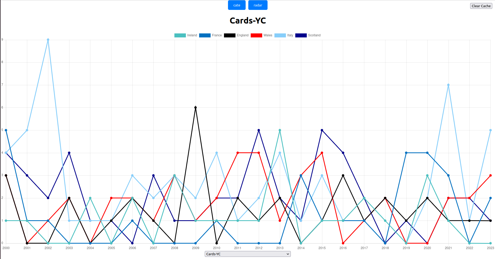
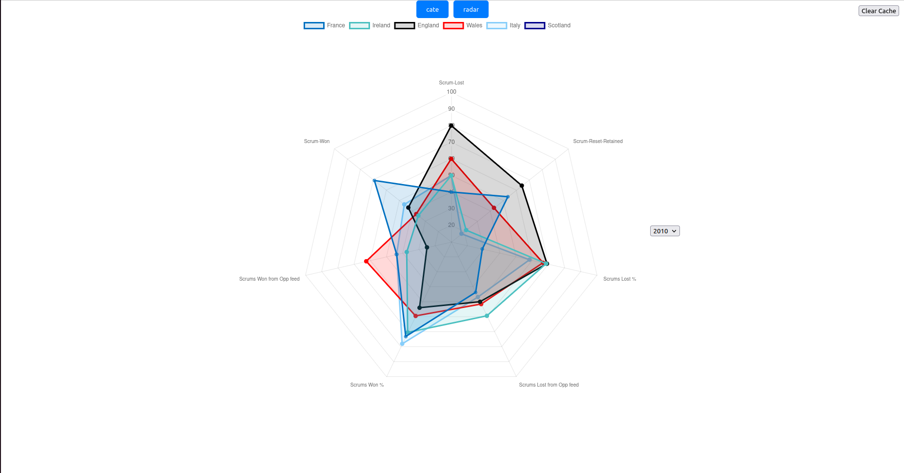

# App React

Maintenant qu'on a les data et l'API, nous pouvons passer à l'affichage des stats via deux graphiques : courbes et radar, avec la lib [chart.js](https://www.chartjs.org/).

## Sommaire

- [Lancer le Dashboard](README.md#lancer-le-dashboard)
- [Fontionnement du Dashboard](README.md#fontionnement-du-dashboard)
- [Graphique Courbes](README.md#graphique-courbes)
- [Graphique Radar](README.md#graphique-radar)

## Lancer le Dashboard

 - Aller a la racine du projet React :
    ```bash
    cd frontdata6nations/
    ```

- Installer les dépendances :
    ```bash
    npm install
    ```
- Avoir l'[API](../API/) de lancer lors du premier lancement de l'app

- lancer l'app 
    ```bash
    npm start
    ```

- [doc React](/AppReact/frontdata6nations/DocReact.md) 

## Fontionnement du Dashboard

En premier lieu le Dashboard pour chaque équipes vérifie si leurs statistiques sont bien enregistrer dans le local storage, sinon il requête l'api pour les récupérer et les stocker. Une fois les données initialisées, chaque graphique récupère les datas via le local storage pour éviter des requêtes en masse sur l'api. Arriver la page vous avez le choix, via les boutons bleus en haut, de choisir d'afficher soit le [cate](README.md#graphique-courbes), soit le [radar](README.md#graphique-radar). Chaque graphique est indépendant de l'autre.

## Graphique Courbes

Comme dit plus haut le graphique Courbes, dit cate, récupère les datas de chaque équipe de chaque année par rapport à une statistique, cela veut dire par exemple, qu'il récupère toutes les données des cartons jaunes de chaque année pour chaque équipe et les affiches sous forme d'un graphique courbe :



De plus, vous pouvez choisir quelles statistiques afficher parmi toutes les statistiques que l'API propose via le sélecteur en bas de la page.

## Graphique Radar

Pour le graphique radar, lui récupère les datas de chaque équipe, mais seulement pour une année et pour un ensemble de statistiques précis comme pour cet exemple pour la mêler. Le problème étant que chaque statistique n'est pas sur la même échelle, donc je viens faire un produit en croix : (ValeurDeBase * 100)/ getMax(ValeurDeBase), pour récupérer un pourcentage et mettre chaque statistique sur une échelle de 100. Ici, nous pouvons voir le radar pour l'année 2010 :



Vous pouvez, pour comparer, changer l'année via le selecteur a droite du graphique.